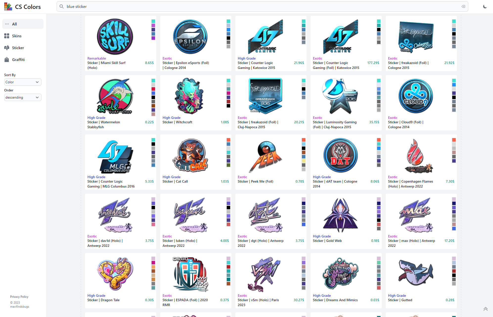

# CS Colors

A blazing fast website for searching Counter Strike 2 Skins, Stickers and Graffiti by color.

## Usage

Curious about how the search works? Here are some examples:
 * blue m4 in the bravo collection
 * red sticker from 2014
 * yellow holo sticker !blue
 * cobblestone collection
 * blue usp skin
 * ...

## Development

### Supabase Backend

This project uses a Supabase Backend. Make sure you have set up the corresponding Supabase environment variables in the `.env.local` file.
You can use the official public `PUBLIC_SUPABASE_URL` and `PUBLIC_SUPABASE_KEY` environment variables for this.
### How to build and run
Run `npm install` in order to install all necessary dependencies.

After that you can simply run `npm run dev`

## Notes

This is my first time working with Svelte. I created this for fun, the code is horrible but at least it's fast :)
